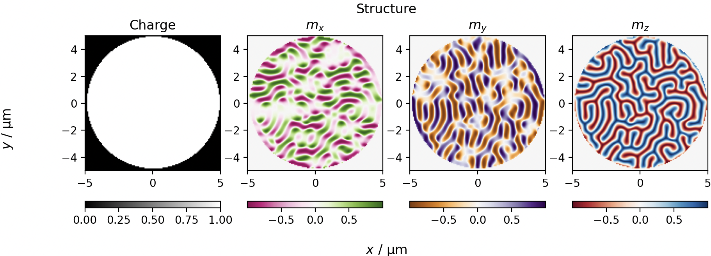
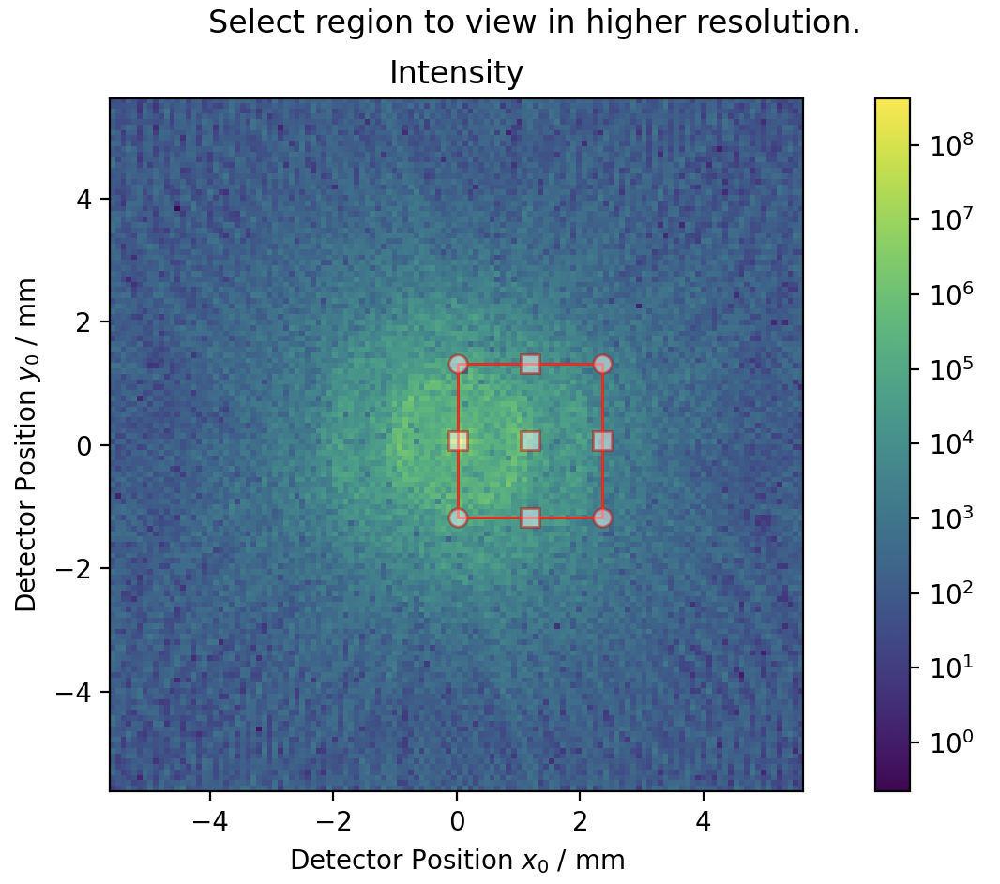
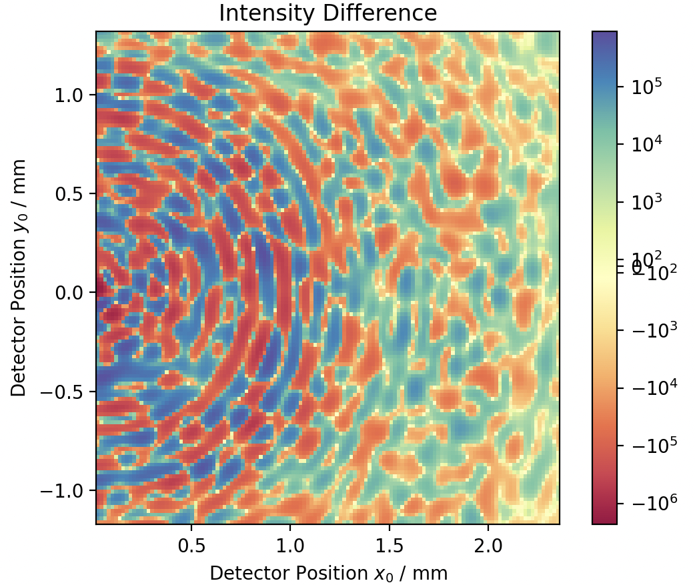
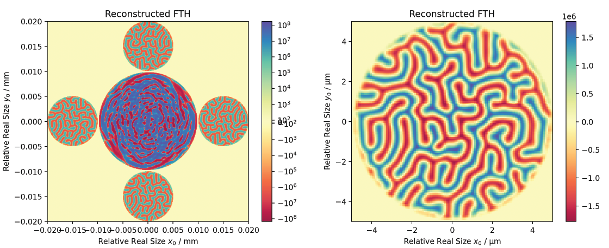

Examples
========

Holography
----------

The example here describes the process followed by the function ``dichroism()`` in the ``examples.py`` file. More
specifically, Fourier transform holography is used to recover the out-of-plane (:math:`z` component) magnetization in
the sample by harnessing x-ray magnetic circular dichroism (XMCD).

Initializations
^^^^^^^^^^^^^^^

The example below uses the labyrinthine domain pattern supplied with the package:

First, the experimental setup and sample is specified using the ``Sample``, ``Beam`` and ``Geometry`` classes.
The sample length describes the real-space size of the numpy array ``mag_config`` (end-to-end dimension).

Subsequently, two beam's are described: a circular left polarized beam, with stokes parameters ``[1, 0, 0, 1]`` and a
circular right polarized beam, with stokes parameters ``[1, 0, 0, -1]``. The wavelength and full-width at half maximum
(provided in meters) are also necessary for the experiment.

Then, a geometry class is created that contains information such as the distance between the sample and detector and
the angle of incidence of the beam.

.. code-block::

    # create the sample
    sample = scatter.Sample(sample_length, scattering_factors, mag_config)

    # create a circular left and circular right polarized beam, sensitive to the z component
    beam_cp = scatter.Beam(scatter.en2wave(energy), [fwhm, fwhm], pol_dict['CL'])
    beam_cl = scatter.Beam(scatter.en2wave(energy), [fwhm, fwhm], pol_dict['CR'])

    # describe the geometry
    geometry = scatter.Geometry(angle, detector_distance)

Scattering
^^^^^^^^^^

The scattering pattern is calculated as soon as the ``Scatter`` object is created. The ``Scatter`` class takes the
experimental parameters defined above, namely the beam, sample and geometry, in order to calculate the expected
scattering pattern:

.. code-block::

    s_cp = scatter.Scatter(beam_cp, sample, geometry)
    s_cl = scatter.Scatter(beam_cl, sample, geometry)

Plotting Scattering Patterns
^^^^^^^^^^^^^^^^^^^^^^^^^^^^

To zoom in on a specific section of the scattering pattern to re-calculate it with finer details, the function
``plot.intensity_interactive(Scatter)`` can be used.

.. code-block::

    # bring up interactive intensity plot to select region of interest
    returned_roi = plot.intensity_interactive(s_cp, log=True)

    # the selected region is provided to the scattering classes and the calculation is performed again
    s_cl.roi = returned_roi
    s_cp.roi = returned_roi

When a parameter of the scattering class is updated, the scattering is re-evaluated to match the new parameter. Here,
by updating the ``roi`` parameter, the scattering patterns are updated. Then, the difference between the scattering
patterns obtained using circular left and circular right polarizations can be plotted using:

.. code-block::

    plot.difference(s_cl, s_cp, log=True)
    plt.show()

This gives the following figure, where the scattering pattern within the region of interest is plotted. This reveals
a difference in the scattered intensities between the two polarizations, concentric rings due to the circular object,
and a higher intensity ring around :math:`1.75~\text{mm}` due to the size of the domains.

Preparing Sample for Holography
^^^^^^^^^^^^^^^^^^^^^^^^^^^^^^^

For holography to work, a reference hole is necessary. This can be introduced by calling the function

.. code-block::

    holography_reference(sample, reference_hole_size, 'xy')

This adds the smallest possible padding and reference hole to allow a full reconstruction. In this example, holes are
added in both :math:`x` and :math:`y` directions. Again, by changing the sample class automatically updates the
scattering pattern.

Viewing Holography Reconstruction
^^^^^^^^^^^^^^^^^^^^^^^^^^^^^^^^^

The scattering pattern can be inverted using the ``invert_holography(...)`` function in the ``holography.py`` file.
This is automatically done by calling the plotting function:

.. code-block::

    plot.holography(s_cp, s_cl, log=True, recons_only=False)  # entire pattern
    plot.holography(s_cl, s_cp)  # only sample reconstruction
    plt.show()

The first call plots the entire holographic reconstruction (left panel), which contains a large central part caused by
the auto-correlation of the structure with itself. On the position of the reference holes, it is now possible to see the
reconstruction of the :math:`m_z` component of the magnetization. This is because the reference hole has been convolved
with the magnetic structure, and since the reference hole is similar to the :math:`\delta` function, the structure is
recovered. Complex conjugate reconstructions appear at mirror-symmetric locations. The second call in the example code
only focuses on the reconstruction (right panel)

          (Right) Focus on the reconstruction of the z component of the magnetization.

Comparing the :math:`m_z` component in the initial structure (from the first figure) with the final reconstruction, it
can be seen that the magnetization was correctly recovered.

Full Code
^^^^^^^^^

The full code from the ``examples.py`` file can be seen here:

.. raw:: html

    

    
<a>View Code</a>

.. include:: ../../magneticScattering/examples.py
    :literal:

.. raw:: html

   
